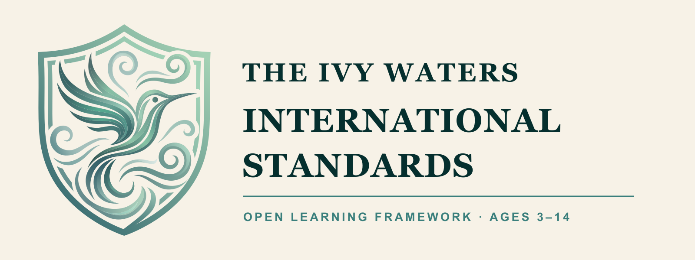
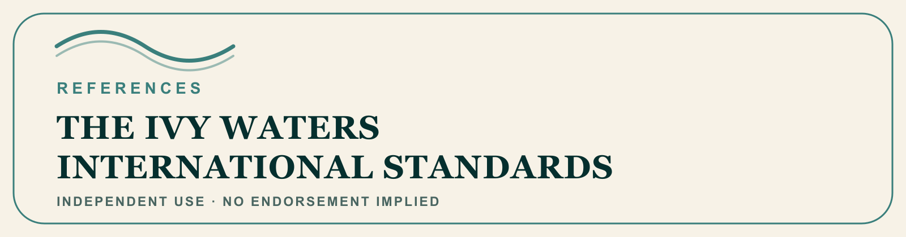

<p align="center">
  
</p>

# The Ivy Waters International Standards

An open learning framework for ages 3–14, published by Ivy Waters
International.

**Open Standards for the future of learning.**

The Standards describe observable capabilities without prescribing one
curriculum, route, pace, or way to demonstrate learning. Families and
educators can use the stable identifiers to plan, document learning, build
tools, or translate evidence between contexts.

## Current release

- **Version:** 2.2.0
- **Published:** 3 September 2026
- **Catalog:** 138 standards across 52 guides and 10 age-anchored stages
- **Machine-readable release:**
  [`releases/v2.2.0/ivy-waters-international-standards.v2.2.0.json`](releases/v2.2.0/ivy-waters-international-standards.v2.2.0.json)
- **Public reader:** <https://ivywaters.com/standards>
- **Permanent standard links:** `https://ivywaters.com/standards/{ID}`

For example, `G3.M-01` resolves at
<https://ivywaters.com/standards/G3.M-01>.

## Open license

The Standards catalog and the documentation in this repository are licensed
under the [Creative Commons Attribution 4.0 International license](LICENSE.md)
(`CC BY 4.0`). You may share and adapt the material, including commercially,
provided you give appropriate credit, link to the license, and indicate
whether changes were made.

The license does not grant trademark rights. The Ivy Waters International
name, crest, and product marks remain protected. See
[BRAND-GUIDELINES.md](BRAND-GUIDELINES.md).

## Cite the Standards

Preferred whole-framework citation:

> Ivy Waters International. (2026). *The Ivy Waters International Standards*
> (Version 2.2.0). https://ivywaters.com/standards. Licensed under CC BY 4.0.

Preferred standard-level citation:

> Ivy Waters International. (2026). “{Title}” ({ID}), in *The Ivy Waters
> International Standards* (Version 2.2.0).
> https://ivywaters.com/standards/{ID}. Licensed under CC BY 4.0.

Machine-readable citation metadata is available in
[`CITATION.cff`](CITATION.cff).

## If you adapt the Standards

CC BY 4.0 permits adaptations. Make the distinction between the source and
your changes clear. A useful notice is:

> Adapted from *The Ivy Waters International Standards* v2.2.0, © 2026 Ivy
> Waters International, licensed under CC BY 4.0. Changes made: {briefly
> describe changes}. This adaptation is independent and is not endorsed by
> Ivy Waters International.

Do not use the Ivy Waters crest or branding to imply that an adaptation is an
official Ivy Waters edition. See [NOTICE.md](NOTICE.md) for attribution and
modification examples.

## If your work references the Standards

The reference badge below may be used unmodified to say, truthfully and
without endorsement, that a work references or maps to one or more permanent
Standards identifiers. Place the release version and a link to the public
reader next to it.

<p align="center">
  
</p>

This is not a certification, compliance, accreditation, or compatibility
seal. It does not make the work an official Ivy Waters publication and does
not grant permission to use the crest. See
[BRAND-GUIDELINES.md](BRAND-GUIDELINES.md) for the complete boundary.

## Data model

- `id` is the permanent public identifier for a standard and is safe to store
  in records.
- `code` is only unique within its guide. Never match across stages on `code`
  alone.
- Ages are the universal anchor. Grade names are Ivy Waters stage labels, not
  claims about any national school system.
- `citizenship` is the stable domain key. Its canonical public display name is
  **Good Citizenship/Humanities**.
- Historical records keep the meaning an identifier had in the release cited
  when alignment was approved.

## Public boundary

This repository contains the parent-facing Standards only. It intentionally
does **not** contain:

- private family records, learner data, or product telemetry;
- the Ivy Waters application or database source code;
- internal registrar translation mappings to external frameworks;
- third-party curriculum text or logos;
- Ivy Waters brand artwork other than the official publisher mark shown above;
  or
- draft, superseded, or unapproved catalog proposals.

## Validate a release

Node.js 22 or later is sufficient; there are no runtime dependencies.

```bash
npm run validate
```

The validator checks release identity, catalog counts, permanent-ID
uniqueness, the publication manifest and checksum, public-boundary fields,
external-name leakage, and CC BY 4.0 metadata. The repository workflow runs
the same validator on every pull request and push to `main`.

## Changes and governance

The release process preserves permanent identifiers and publishes a changelog
for every catalog change. Proposed content changes require Ivy Waters owner
review before they can become an official Ivy Waters release. Forks and
adaptations remain free to evolve under CC BY 4.0, but must identify their
changes and must not imply endorsement.

See [GOVERNANCE.md](GOVERNANCE.md), [CHANGELOG.md](CHANGELOG.md), and
[CONTRIBUTING.md](CONTRIBUTING.md). The private-to-public release boundary is
documented in [docs/MIRROR-PROTOCOL.md](docs/MIRROR-PROTOCOL.md).

The publisher mark identifies this as the official Ivy Waters release. It is
not licensed under CC BY 4.0 and may not be used to imply endorsement of an
adaptation. See [BRAND-GUIDELINES.md](BRAND-GUIDELINES.md).
